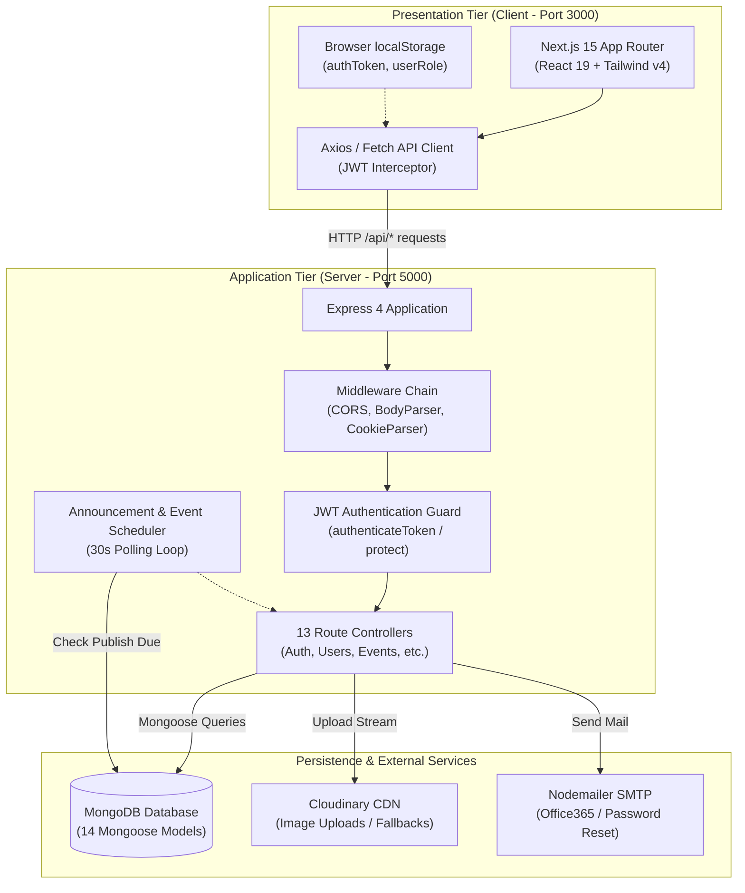

# System Architecture & Technical Design

This document details the high-level architecture, subsystem boundaries, data flow pipelines, background processes, and security mechanisms of the **ICPEP.SE CIT-U Chapter Official Website**.

---

## 🏛️ System Topology

The platform uses a classic decoupled MERN architecture with clear separation between the presentation tier (Next.js 15), API/Application tier (Express + Node.js), persistence layer (MongoDB), and third-party media/email services.



---

## 🌐 Frontend Architecture (Next.js 15 App Router)

The client application is located in `client/` and leverages Next.js 15 with Turbopack, React 19, and Tailwind CSS v4.

### Route & Component Directory Layout
- **Root Layout (`client/src/app/layout.tsx`)**: Global typography (Rubik & Raleway fonts), metadata, header navigation, and global footer.
- **Root Page (`client/src/app/page.tsx`)**: Redirects visitors directly to `/home`.
- **Public Showcase Pages**:
  - `/home`: Chapter landing page with hero banner, dynamic statistics, upcoming events, and partner logos.
  - `/about`: Vision, mission, department history, and organizational objectives.
  - `/events` & `/events/[id]`: Event discovery, attendee registration, and date filtering.
  - `/announcements` & `/announcements/[id]`: Organization news, category tabs, and media galleries.
  - `/officers`: Interactive directory of council executives and committee chairs.
  - `/merch`: Official chapter apparel and merchandise catalog.
  - `/faq` & `/contact-us`: Member support inquiries and frequently asked questions.
- **Member & Officer Portals**:
  - `/login`: Multi-step authentication with first-time password reset enforcement.
  - `/dashboard`: Role-based gateway (`/dashboard/officer` vs `/dashboard/student`).
  - `/profile`: Personal profile management and membership verification.
  - `/commeet`: Committee meeting scheduler, time-slot picker, and availability tracker.
  - `/users`: Superadmin member management table with CSV/Excel sync.
  - `/create/*`: Content management forms for announcements, events, sponsors, and merch.

### API Communication Layer
All client-to-server communication is handled through modular services in `client/src/app/services/`:
- Requests are pre-configured with a 30-second timeout and `Content-Type: application/json`.
- An Axios request interceptor injects the Bearer token from `localStorage.getItem("authToken")` automatically:
  ```ts
  api.interceptors.request.use((config) => {
    const token = typeof window !== 'undefined' ? localStorage.getItem('authToken') : null;
    if (token && config.headers) config.headers.Authorization = `Bearer ${token}`;
    return config;
  });
  ```

---

## ⚙️ Backend Architecture (Express + TypeScript)

The server application is located in `server/` and written in strict TypeScript.

### Request Pipeline & Middleware Chain
Incoming requests pass through an ordered pipeline before hitting route handlers:
1. **Body Parsers**: `express.json({ limit: "50mb" })` and `express.urlencoded({ limit: "50mb" })` for parsing JSON payloads and base64 image data.
2. **Cookie Parser**: Parses HTTP cookies for session tracking.
3. **CORS Guard**: Dynamic origin validator allowing localhost, Vercel preview subdomains (`*.vercel.app`), and custom frontend URLs configured in `FRONTEND_URL`.
4. **Development Logger**: Logs method and path in development mode.
5. **Authentication Middleware (`middleware/auth.middleware.ts`)**:
   - `authenticateToken`: Validates JWT token from the `Authorization: Bearer <token>` header, decodes payload, and attaches `req.user`.
   - `protect`: Enforces that the request is authenticated and that the user account is active (`isActive: true`).
6. **404 Route Handler**: Returns standardized JSON error if no matching endpoint is found.
7. **Global Error Middleware**: Catches unhandled exceptions, returning sanitised error messages.

---

## ⏰ Background Announcement & Event Scheduler

Located at `server/src/utils/scheduler.ts`, this in-process scheduler handles automated publishing without requiring external infrastructure:
- **Polling Interval**: Runs every 30 seconds (`intervalMs = 30_000`) once MongoDB is connected.
- **Workflow**:
  1. Queries MongoDB for unpublished items (`isPublished: false, scheduled: true`) where `publishDate <= now`.
  2. Validates image requirements (at least one image required before publishing).
  3. Updates status to `isPublished: true, scheduled: false`.
  4. Triggers `notifyTargetAudience()` to generate in-app notifications for affected users.

---

## 🛡️ Role-Based Access Control (RBAC) Matrix

The platform enforces five distinct user roles defined in `server/src/models/user.ts`:

| Permission / Action | `student` | `committee-officer` | `council-officer` | `faculty` | `admin` |
| :--- | :---: | :---: | :---: | :---: | :---: |
| Browse public content (Home, Events, Merch) | ✅ | ✅ | ✅ | ✅ | ✅ |
| Register for events | ✅ | ✅ | ✅ | ✅ | ✅ |
| Submit committee meeting availability | ❌ | ✅ | ✅ | ❌ | ✅ |
| Create & publish announcements / events | ❌ | ❌ | ✅ | ❌ | ✅ |
| View member directory & search users | ❌ | ❌ | ✅ | ❌ | ✅ |
| Add new users & bulk upload Excel rosters | ❌ | ❌ | ❌ | ❌ | ✅ |
| Toggle user active status / reset passwords | ❌ | ❌ | ❌ | ❌ | ✅ |
| Seed database / system maintenance | ❌ | ❌ | ❌ | ❌ | ✅ |
