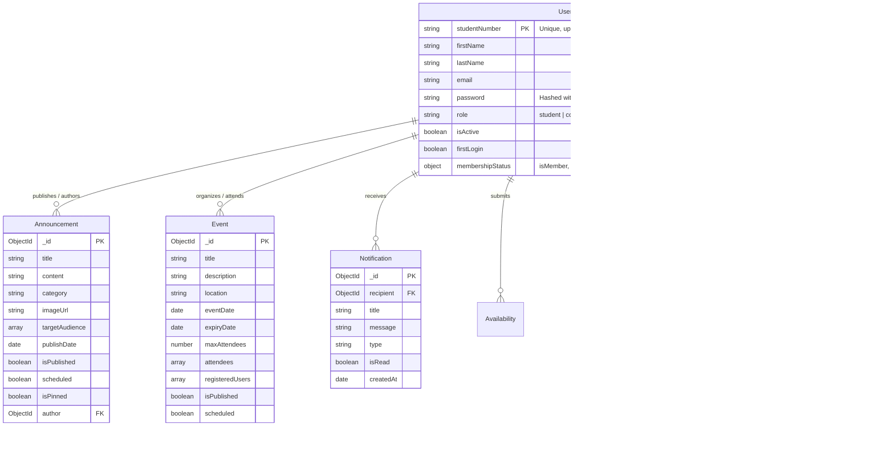

# Database Models & Data Dictionary

The persistence layer is powered by **MongoDB** with schemas defined using **Mongoose 7** in `server/src/models/`.

---

## 🗺️ Entity Relationship Diagram

---

## 📋 Data Dictionary

### 1. `User` Model (`models/user.ts`)
The core user identity model used for authentication and role authorization.

| Field | Type | Required | Default | Description |
| :--- | :--- | :---: | :---: | :--- |
| `studentNumber` | `String` | Yes | - | Unique CIT-U student number, uppercase, indexed. |
| `firstName` | `String` | Yes | - | First name, trimmed. |
| `lastName` | `String` | Yes | - | Last name, trimmed. |
| `middleName` | `String` | No | `null` | Middle name. |
| `email` | `String` | No | `null` | Lowercase email address. |
| `password` | `String` | Yes | `"123456"` | Hashed using Bcrypt pre-save hook (cost 10). Hidden by default (`select: false`). |
| `role` | `String` | Yes | `"student"` | Enum: `student`, `council-officer`, `committee-officer`, `faculty`, `admin`. |
| `position` | `String` | No | `null` | Officer/faculty designated position title. |
| `department` | `String` | No | `null` | Academic department (default: Computer Engineering). |
| `yearLevel` | `Number` | No | - | Integer from `1` to `5`. |
| `membershipStatus` | `Object` | Yes | `{ isMember: false }` | Sub-document: `isMember: Boolean`, `membershipType: "local" \| "regional" \| "both" \| null`, `validUntil: Date`. |
| `profilePicture`| `String` | No | `null` | Secure CDN image URL. |
| `isActive` | `Boolean` | Yes | `true` | Account active state (deactivated accounts blocked). |
| `registeredBy` | `ObjectId` | No | `null` | Ref to admin `User` who provisioned the account. |
| `firstLogin` | `Boolean` | Yes | `true` | Requires password change on initial authentication. |
| `resetPasswordCode` | `String` | No | - | 6-digit OTP code (`select: false`). |
| `resetPasswordExpire` | `Date` | No | - | Expiration timestamp for reset OTP. |

**Virtuals**:
- `fullName`: Concatenates `firstName + middleName + lastName`.
- `registeredByName`: Resolves `registeredBy` user's full name.

---

### 2. `Announcement` Model (`models/announcement.ts`)
Official organization broadcasts and news articles.

| Field | Type | Required | Default | Description |
| :--- | :--- | :---: | :---: | :--- |
| `title` | `String` | Yes | - | Headline of announcement. |
| `content` | `String` | Yes | - | Body text (markdown/HTML supported). |
| `category` | `String` | Yes | `"general"` | Category (e.g. `academic`, `event`, `news`, `merch`). |
| `imageUrl` | `String` | No | - | Hero cover image URL. |
| `galleryImages`| `[String]`| No | `[]` | Additional media photos. |
| `targetAudience`| `[String]`| Yes | `["all"]` | Target role filter: `all`, `student`, `officer`, etc. |
| `publishDate` | `Date` | No | - | Timestamp for scheduled release. |
| `scheduled` | `Boolean` | Yes | `false` | If true, waiting for scheduler publication. |
| `isPublished` | `Boolean` | Yes | `true` | Visibility flag. |
| `isPinned` | `Boolean` | Yes | `false` | Pins item to top of announcements feed. |
| `author` | `ObjectId` | No | - | Ref to `User` author. |

---

### 3. `Event` Model (`models/event.ts`)
Seminars, hackathons, workshops, and chapter activities.

| Field | Type | Required | Default | Description |
| :--- | :--- | :---: | :---: | :--- |
| `title` | `String` | Yes | - | Event title. |
| `description` | `String` | Yes | - | Detailed description and agenda. |
| `location` | `String` | Yes | - | Physical venue or virtual link (e.g. Google Meet). |
| `eventDate` | `Date` | Yes | - | Starting date and time. |
| `expiryDate` | `Date` | No | - | Conclusion timestamp. |
| `imageUrl` | `String` | No | - | Event poster URL. |
| `maxAttendees` | `Number` | No | `null` | Capacity limit. |
| `attendees` | `[String]`| No | `[]` | List of confirmed student numbers. |
| `registeredUsers`| `[ObjectId]`| No | `[]` | Ref to registered `User` accounts. |
| `isPublished` | `Boolean` | Yes | `true` | Visibility flag. |
| `scheduled` | `Boolean` | Yes | `false` | Managed by background scheduler. |

---

### 4. `Meeting` (`models/meeting.ts`) & `Availability` (`models/availability.ts`)
Committee coordination and officer availability tracking.

- **`Meeting`**: Stores title, committee name, agenda, date, meeting link, and attendee user IDs.
- **`Availability`**: Stores weekly time slots (days and hours) submitted by council and committee officers to find optimal meeting windows.

---

### 5. `Notification` Model (`models/notification.ts`)
Personalized in-app alerts and announcements.

| Field | Type | Required | Default | Description |
| :--- | :--- | :---: | :---: | :--- |
| `recipient` | `ObjectId` | Yes | - | Ref to `User` receiving the notification. |
| `title` | `String` | Yes | - | Notification subject. |
| `message` | `String` | Yes | - | Notification body text. |
| `type` | `String` | Yes | `"system"` | Enum: `announcement`, `event`, `system`, `meeting`. |
| `relatedId` | `ObjectId` | No | - | Link to announcement, event, or meeting ID. |
| `isRead` | `Boolean` | Yes | `false` | Read status. |

---

### 6. Supporting Catalog Models

- **`Merch` (`models/merch.ts`)**: Chapter shirts, lanyards, hoodies with price, sizes array, stock levels, and active status.
- **`Membership` (`models/membership.ts`)**: Membership applications, registration dates, transaction receipts, and approval states.
- **`OfficerHistory` & `FacultyProfile`**: Historical council directories and department faculty bios.
- **`Sponsor` & `Partner`**: Corporate partners, tier levels, logos, and website links.
- **`Testimonial` & `FAQ`**: Featured student testimonials and categorized question/answer pairs.
